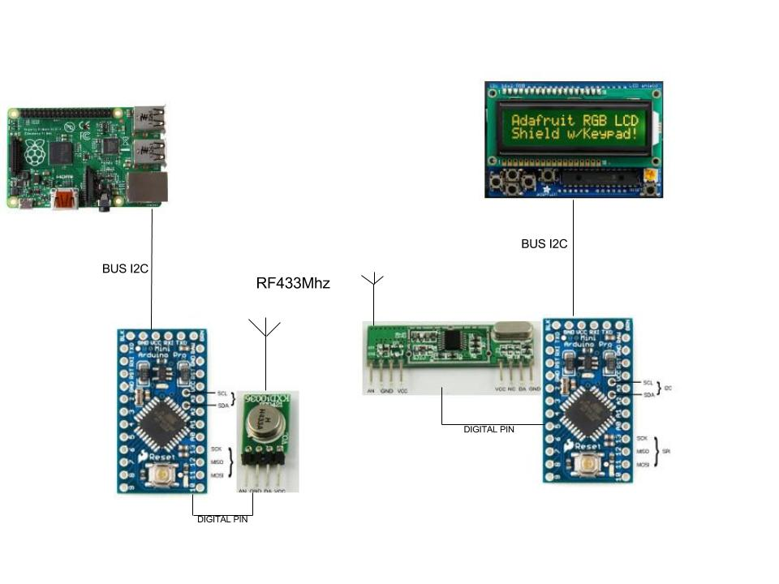

# Horaire-bus-RATP-LCD-
Affiche l'horaire du prochaine bus sur un afficheur LCD (Raspberry + miniArduino)

# Principe:
La raspberry recupere l'horaire du prochain bus et stock la valeur dans le fichier 187.txt.
Cette valeur est ensuite envoyée au mini arduino(transmetter.ino) via le busI2C.
Le LCD qui affiche les informations est connecté sur un autre mini arduino(receiver.ino) qui recoit les info via une liaison RF433Mhz.

Schema explicatif

*TO DO*
* Monitoring du traffic RERB avec alerte sur le LCD si traffic perturbé

